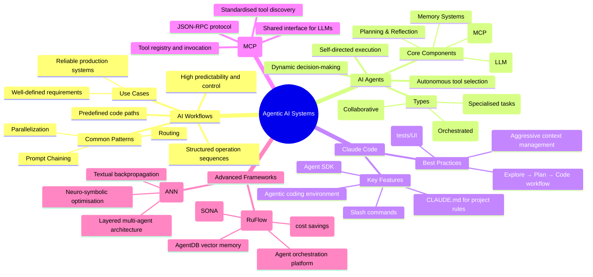

# Mind Map — Agentic AI Systems
> Generated by NotebookLM · 2026-05-06 · Source: [[ruflo_claude_primitives]] · [[ruflo_architecture]]

```mermaid
mindmap
  root((Agentic AI Systems))
    AI Workflows
      Predefined code paths
      Structured operation sequences
      High predictability and control
      Common Patterns
        Prompt Chaining
        Routing
        Parallelization
      Use Cases
        Reliable production systems
        Well-defined requirements
    AI Agents
      Dynamic decision-making
      Autonomous tool selection
      Self-directed execution
      Core Components
        Reasoning Engine (LLM)
        Memory Systems
        Tool Access (MCP)
        Planning & Reflection
      Types
        Subagents (Specialised tasks)
        Agent Teams (Collaborative)
        Swarms (Orchestrated)
    Claude Code
      Key Features
        Agentic coding environment
        CLAUDE.md for project rules
        Slash commands
        Agent SDK
      Best Practices
        Aggressive context management
        Verification criteria (tests/UI)
        Explore → Plan → Code workflow
    Model Context Protocol (MCP)
      Standardised tool discovery
      JSON-RPC protocol
      Shared interface for LLMs
      Tool registry and invocation
    Advanced Frameworks
      ruflo (RuFlow)
        Agent orchestration platform
        Self-learning (SONA)
        3-tier model routing (cost savings)
        AgentDB vector memory
      Agentic Neural Networks (ANN)
        Textual backpropagation
        Neuro-symbolic optimisation
        Layered multi-agent architecture
```

Raw JSON: `mindmap.json` (same folder)
